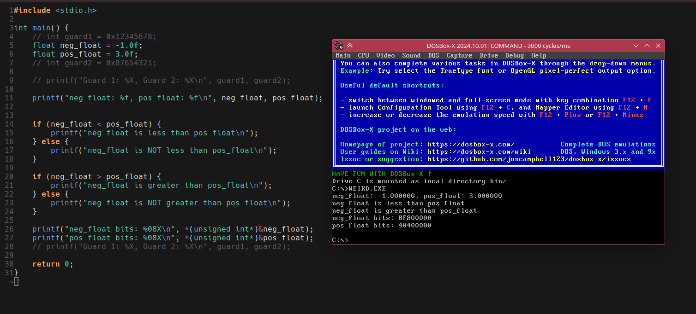

# Weird Dosbox behavior
Floats seem to compare both greater-than and lesser-than:



## Dependencies
DJGPP toolchain for cross-compiling to DOS. [There is a handy package on AUR](https://aur.archlinux.org/packages/djgpp-gcc).

## Compiling

```
mkdir build
cd build
cmake .. -G Ninja -DCMAKE_BUILD_TYPE=Debug -DCMAKE_EXPORT_COMPILE_COMMANDS=true -DCMAKE_INSTALL_PREFIX=../bin
cd ..
cmake --build build && cmake --install build
```

## Running
Simply run bin/weird.exe in Dosbox.

CWSDPMI.EXE is from here:
https://www.ibiblio.org/pub/micro/pc-stuff/freedos/files/distributions/1.2/repos/pkg-html/cwsdpmi.html
